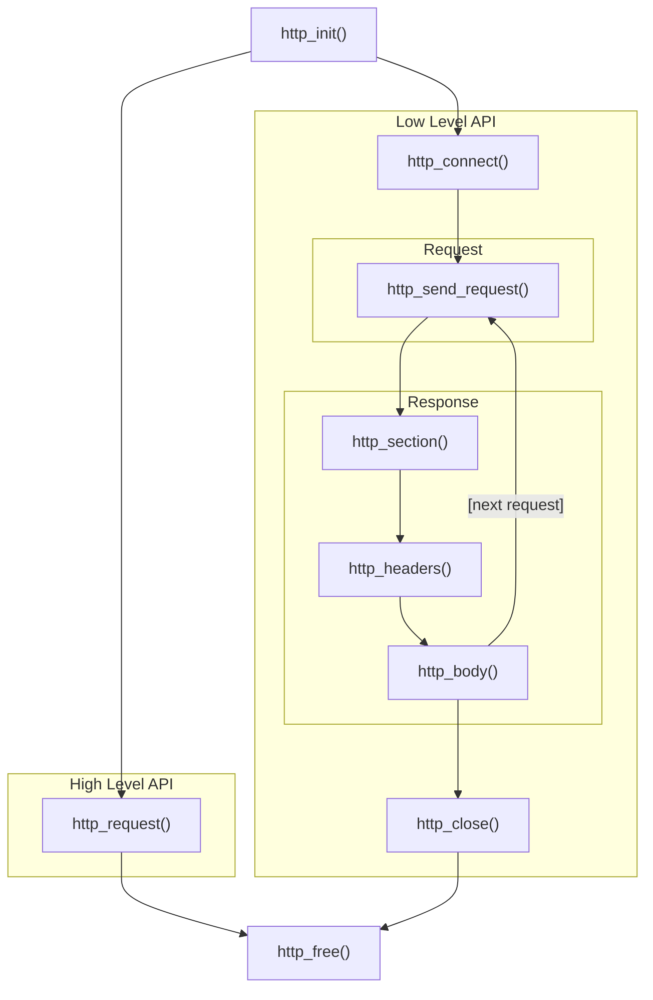

# Network Module

## HTTP Overview

This module provides a TCP-based HTTP/1.1 client with support for:

- **HTTP/HTTPS**: TLS enabled automatically when port is 443 or `HTTP_SSL` flag is set
- **Cookie management**: With `HTTP_COOKIEJAR`, parses Set-Cookie and sends cookies on subsequent requests
- **Auto redirect**: With `HTTP_REDIRECT`, follows 302 redirects automatically (up to 5 times)
- **Chunked transfer**: Supports `Transfer-Encoding: chunked` response bodies
- **IPv4/IPv6**: Pass network mode flags from `tcp.h` via `http_mode`

### Usage modes

1. **High-level API**: `http_request` / `http_get` / `http_get_root` — one call handles connect, send, receive, parse, and close
2. **Low-level API**: `http_connect` → `http_send_request` → `http_section` (headers) → read body → `http_close` — for streaming or custom parsing (e.g. speedtest)

---

## Function Lifecycle

### Typical lifecycle (high-level API)

- `http_init` initializes the `http_t` struct, allocates body buffer, cookiejar (if enabled), and SSL context (if HTTPS)
- `http_request` connects, sends, reads, parses, and closes internally; the returned pointer refers to `http->body->data` and lives as long as `http`
- After the request, call `http_free`

### Typical lifecycle (low-level API)

- `http_connect` establishes the TCP connection and performs SSL handshake when HTTPS is used
- `http_send_request` sends the request line and headers (Cookie, Host, etc.)
- Read the response: `http_section` (header block) → parse headers → read body (e.g. `http_read`)
- `http_close` closes the socket; **call `http_close` before `http_free`**; you may call `http_connect` again for another request, or `http_free` when done

---

## Call Order

### High-level API

1. `http_init(http, domain, port, http_mode)`
2. `http_request(http, path, data)` or `http_get(http, path)` or `http_get_root(http)`
3. (Optional) `http_status_code(http)` to get status code
4. `http_free(http)`

### Low-level API

1. `http_init(http, domain, port, http_mode)`
2. `http_connect(http)` — must succeed before continuing
3. `http_send_request(http, path, data)` — must succeed before reading
4. Read the response:
   - `http_section(http, buf, sizeof(buf))` — read entire header block
   - Parse headers, then read body (e.g. `http_read(http, buf, len)` or `http_readline`)
5. `http_close(http)` to close the connection
6. `http_free(http)` — call after `http_close` when fully done

**Redirect toggles** (`http_enable_redirect` / `http_disable_redirect`) affect only `http_request`; they have no effect on the low-level API.

---

## Error Handling

### Return value conventions

| Function                   | Success                     | Failure                                           |
| -------------------------- | --------------------------- | ------------------------------------------------- |
| `http_init`                | 0                           | -1                                                |
| `http_connect`             | 0                           | -1                                                |
| `http_send_request`        | 0                           | -1                                                |
| `http_request`             | `const char *` to body      | NULL                                              |
| `http_write` / `http_read` | bytes written/read          | -1 (may return bytes read so far on partial read) |
| `http_readline`            | length written (incl. `\0`) | 0 means EOF or error                              |
| `http_section`             | number of header lines      | 0 means no valid headers                          |
| `http_status_code`         | status code (e.g. 200)      | <0 on parse error                                 |

### Cleanup after errors

- **`http_init` failed**: No need to call `http_free`; the struct may be partially initialized; zero it or do not reuse
- **`http_connect` failed**: Connection not established; call `http_free` directly, no `http_close` needed
- **`http_send_request` failed**: Connection is open; call `http_close` then `http_free`
- **`http_request` returned NULL**: Connection already closed internally; call `http_free` only
- **`http_read*` error in low-level API**: Decide whether to continue reading or call `http_close` immediately, then `http_free`

### Redirects

- With `HTTP_REDIRECT`, `http_request` will recursively follow 302 up to 5 times
- After 5 redirects or invalid Location, `http_request` returns NULL
- On each redirect, it closes the current connection and opens a new one

### Cookies

- `cookiejar_resolve` is called internally by `http_request` after parsing headers; users rarely need to call it
- `cookiejar_add` is for manually injecting cookies (e.g. session)
- The pointer from `cookiejar_str` is invalid after the cookiejar is modified or freed
